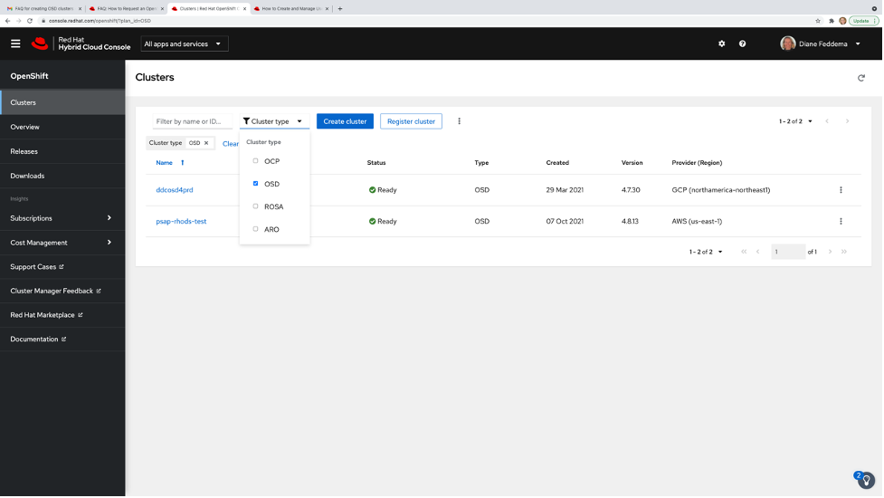
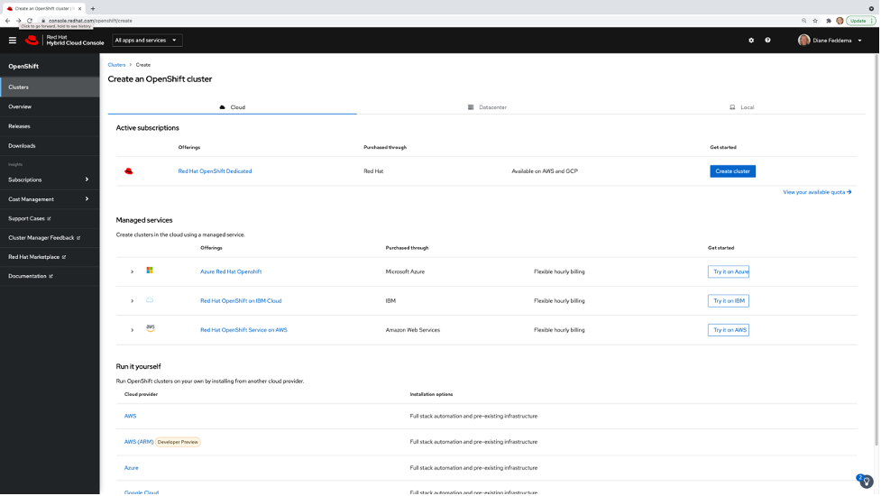
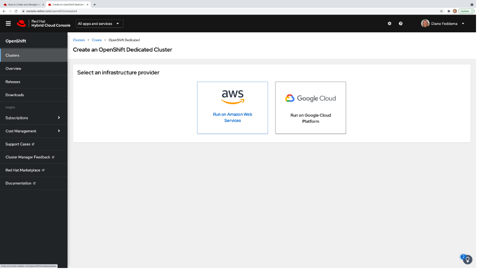
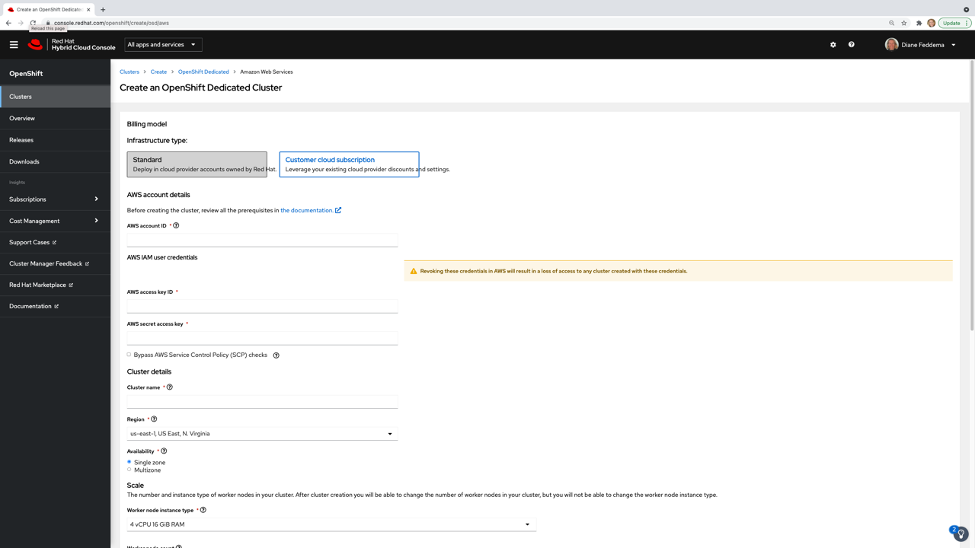
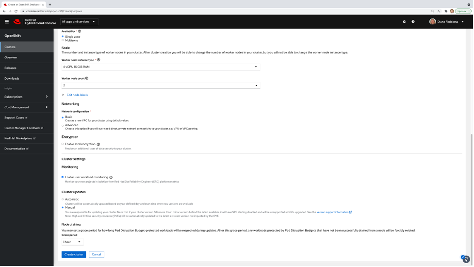
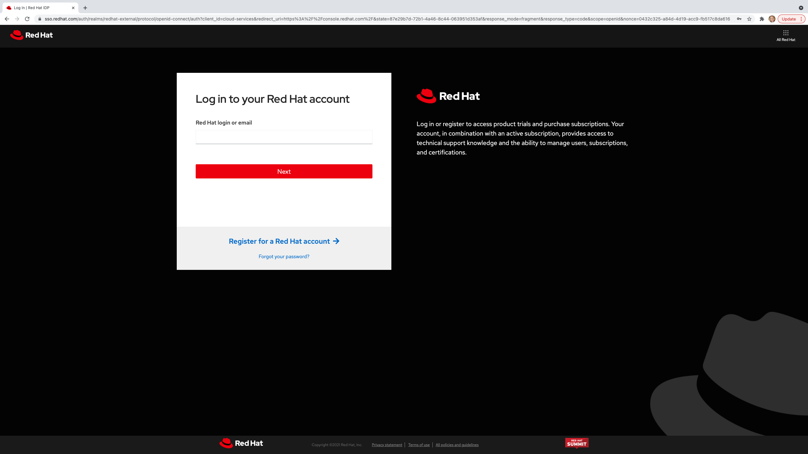

# cluster-setup
- [cluster-setup](#cluster-setup)
  - [Create Cluster from OCM web console](#create-cluster-from-OCM-web--console)
  - [Create Cluster from CLI](#create-cluster-from-CLI)
    - [Connect your ocm CLI](#connect-your-ocm-cli)
    - [Creating a new cluster](#creating-a-new-cluster)
- accessing your new cluster (#accessing-new-cluster)
## create cluster from OCM web console

1) Login to http://console.redhat.com/openshift
2) Select Cluster type "OSD" from the pull down menu and click "Create cluster"

3) Click "Create Cluster" again

4)Click "AWS" 

5)Enter AWS account details (AWS access key ID and AWS secret access key)



## create cluster from CLI
### download ocm cli for your operating system
https://console.redhat.com/openshift/downloads

1) make sure ocm is working for you 
      [user:machine ~]$ ocm list clusters
      
      ### Creating a new cluster

1. Choose your cluster defaults.

    ```shell
    CLUSTER_NAME="dfeddema-test-cluster"     # only lower case letters, numbers, and dashes. 
    printf "my-group-aws-key-id" > .aws-access-key-id
    printf "my-group-aws-account-id" > .aws-account-id
    printf "my-group-aws-secret-access-key" > .aws-secret-access-key
    CLUSTER_SUBSCRIPTION_TYPE="--ccs"      # or leave blank ("")
    CLUSTER_CHANNEL_GROUP="stable"          #
    CLUSTER_MULTI_AZ=""                     # or "--multi-az"
    CLUSTER_CLOUD_PROVIDER="aws"            # gcp not currently an option
    CLUSTER_CLOUD_REGION="us-east-1"
    CLUSTER_COMPUTE_AUTOSCALING_YN="--enable-autoscaling"  # or leave blank ("")
    CLUSTER_COMPUTE_AUTOSCALING_MIN="--min-replicas 2"  # or leave blank ("")
    CLUSTER_COMPUTE_AUTOSCALING_MAX="--max-replicas 6"  # or leave blank ("")
    CLUSTER_COMPUTE_MACHINE_TYPE="m5.xlarge"            # or "g4dn.xlarge" for GPUs
    CLUSTER_FLAVOUR="osd-4"
    CLUSTER_ETCD_ENCRYPTION=""               # leave blank ("") or, if enabled in account, use "--etcd-encryption"
    CLUSTER_VERSION="4.8.13"
    ```

1. Test out your cluster settings before actually creating the cluster, by running with dry-run option set:

    ```shell
    ocm create cluster \
        --dry-run \
        --aws-access-key-id $(cat .aws-access-key-id) \
        --aws-account-id $(cat .aws-account-id) \
        --aws-secret-access-key $(cat .aws-secret-access-key) \
        --provider ${CLUSTER_CLOUD_PROVIDER} \
        --region ${CLUSTER_CLOUD_REGION} \
        ${CLUSTER_MULTI_AZ} \
        --channel-group ${CLUSTER_CHANNEL_GROUP} \
        --flavour ${CLUSTER_FLAVOUR} \
        ${CLUSTER_SUBSCRIPTION_TYPE} \
        ${CLUSTER_COMPUTE_AUTOSCALING_YN} \
        ${CLUSTER_COMPUTE_AUTOSCALING_MIN} \
        ${CLUSTER_COMPUTE_AUTOSCALING_MAX} \
        --compute-machine-type ${CLUSTER_COMPUTE_MACHINE_TYPE} \
        ${CLUSTER_ETCD_ENCRYPTION} \
        --version ${CLUSTER_VERSION} \
        ${CLUSTER_NAME}
    ```

1. Run without `--dry-run` line to create the cluster

    ```shell
    ocm create cluster \
        --aws-access-key-id $(cat .aws-access-key-id) \
        --aws-account-id $(cat .aws-account-id) \
        --aws-secret-access-key $(cat .aws-secret-access-key) \
        --provider ${CLUSTER_CLOUD_PROVIDER} \
        --region ${CLUSTER_CLOUD_REGION} \
        ${CLUSTER_MULTI_AZ} \
        --channel-group ${CLUSTER_CHANNEL_GROUP} \
        --flavour ${CLUSTER_FLAVOUR} \
        ${CLUSTER_SUBSCRIPTION_TYPE} \
        ${CLUSTER_COMPUTE_AUTOSCALING_YN} \
        ${CLUSTER_COMPUTE_AUTOSCALING_MIN} \
        ${CLUSTER_COMPUTE_AUTOSCALING_MAX} \
        --compute-machine-type ${CLUSTER_COMPUTE_MACHINE_TYPE} \
        ${CLUSTER_ETCD_ENCRYPTION} \
        --version ${CLUSTER_VERSION} \
        ${CLUSTER_NAME}
    ```
## accessing new cluster
1) Go to console.redhat.com and login 

